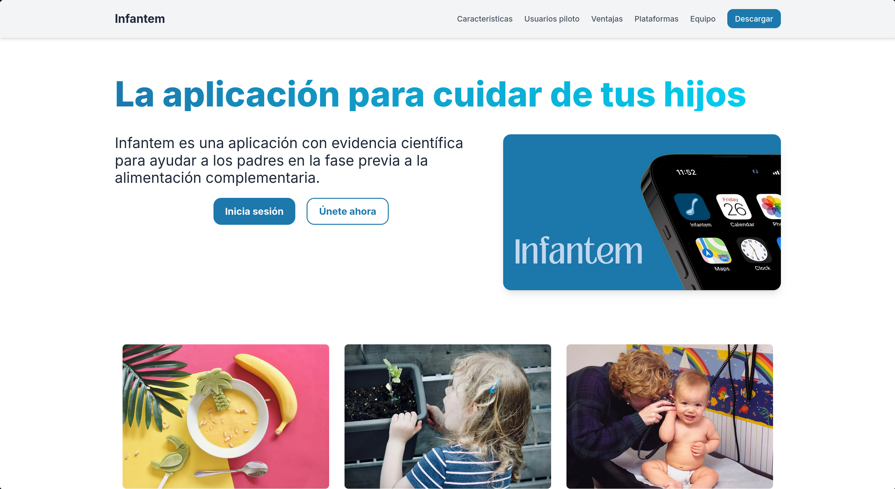

# NutriBaby Landing Page

NutriBaby is a web application designed to assist parents in introducing food to their babies with an evidence-based approach. This repository contains the source code for the landing page, providing an overview of the app, its features, and pricing plans.



## Features
- Responsive and modern UI.
- Informative sections about the app's functionalities.
- Call-to-action (CTA) buttons for user engagement.
- Contact form for inquiries.
- Footer with social media links and additional resources.

## Technologies Used
- **Astro:** 
- **Tailwind CSS (4):** Tailwind CSS
- **Deployment:** Vercel 

## Installation & Setup
To run the landing page locally, follow these steps:

1. Clone the repository:
   ```sh
   git clone https://github.com/ISPP-G-8/landing-page 
   cd landing-page 
   ```

2. Install Dependencies

2.1 Recommended Installation Method: Bun
    We recommend using [Bun](https://bun.sh) for installing dependencies. If you don't have Bun installed, you can do so with:
    ```sh
    curl -fsSL https://bun.sh/install | bash
    ```
    **Note:** After installation, you may need to update your shell configuration file (e.g., `.bashrc`, `.zshrc`) to export the Bun binary path.

2.2 Install Project Dependencies
    Once Bun is installed, install the project dependencies:
    ```sh
    bun install  # As said, you can use npm or any package manager too.
    ```

3. Start the development server:
   ```sh
   bun run dev  # As said, you can use npm or any package manager too.
   ```

The site will be available at `http://127.0.0.1:7777`.


